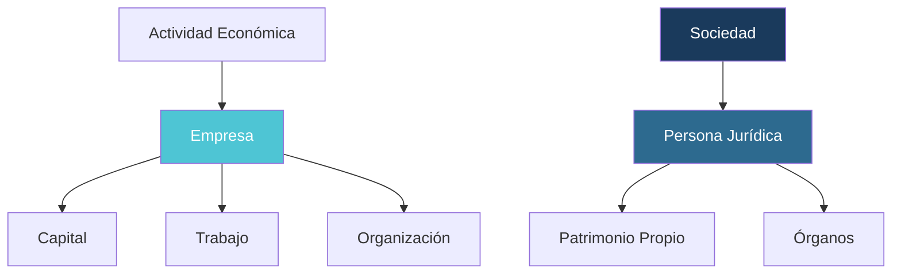
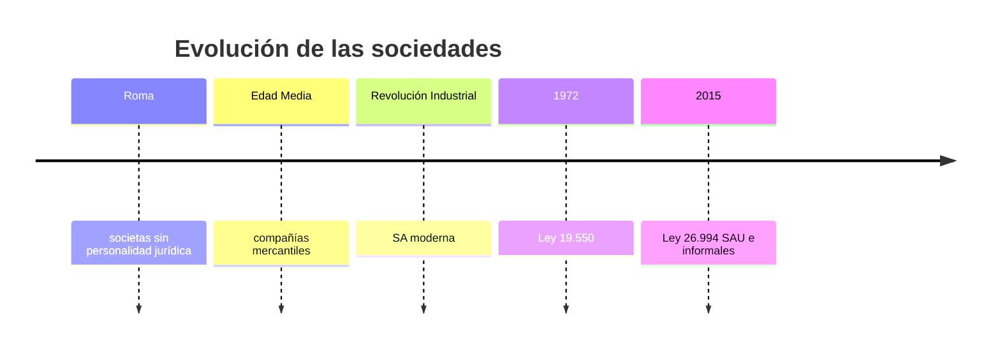
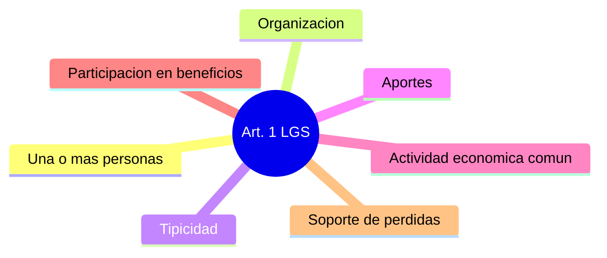
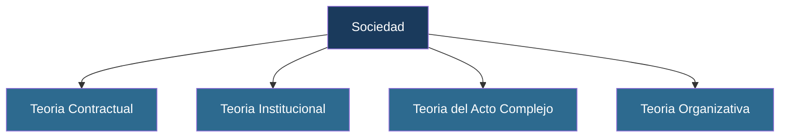
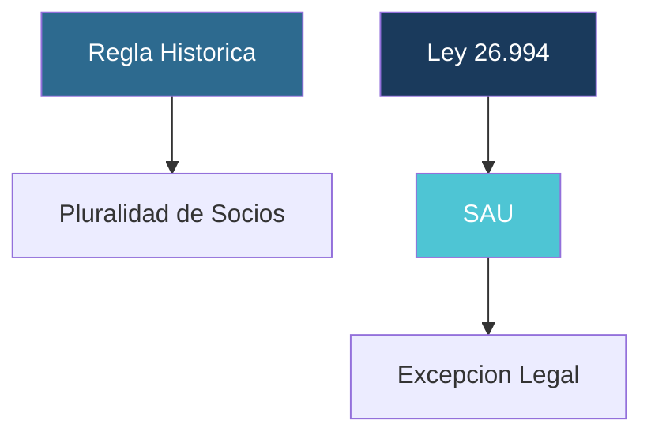
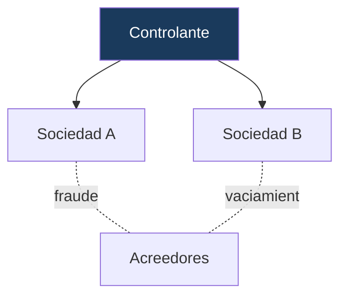

# Las Sociedades en el derecho contemporáneo Argentino
## Clase 1
**Prof. Adj. Dr. Maximiliano Lucas Romei**
Cátedra Dr. Eduardo Favier Dubois (h) · UBA Derecho · Curso de Invierno 2026
---

# LAS SOCIEDADES EN EL DERECHO ARGENTINO CONTEMPORÁNEO

Las sociedades constituyen uno de los instrumentos jurídicos más relevantes para la organización de actividades económicas. A través de ellas se canalizan inversiones, se organizan empresas y se distribuyen riesgos entre quienes participan en la actividad.

Su estudio exige analizar tanto la **Ley General de Sociedades N.º 19.550** como las disposiciones del **Código Civil y Comercial** incorporadas a partir de la reforma de 2015.

---

# ¿QUÉ ESTUDIA EL DERECHO SOCIETARIO?

El Derecho Societario regula la creación, funcionamiento y extinción de las sociedades. Establece las relaciones entre socios, administradores, acreedores y terceros.

Sus principales objetivos son:

- <v-click>Facilitar la actividad económica.</v-click>
- <v-click>Proteger a los inversores.</v-click>
- <v-click>Brindar seguridad jurídica al tráfico comercial.</v-click>
- <v-click>Organizar la responsabilidad derivada de la actividad empresarial.</v-click>

---

# IMPORTANCIA ECONÓMICA DE LAS SOCIEDADES

La mayor parte de la actividad económica organizada se desarrolla mediante sociedades.

Las sociedades permiten:

- <v-click>Reunir capitales.</v-click>
- <v-click>Incorporar conocimientos especializados.</v-click>
- <v-click>Distribuir riesgos.</v-click>
- <v-click>Garantizar continuidad a los emprendimientos.</v-click>
- <v-click>Facilitar el acceso al crédito.</v-click>

---

# SOCIEDAD Y EMPRESA: PRIMERA APROXIMACIÓN

Aunque suelen utilizarse como sinónimos, **sociedad** y **empresa** son conceptos distintos.

- La **empresa** constituye una organización económica destinada a la producción o intercambio de bienes y servicios.
- La **sociedad** es una estructura jurídica creada para organizar esa actividad.

> La empresa pertenece al plano económico; la sociedad pertenece al plano jurídico.

---

# SOCIEDAD Y EMPRESA: ESQUEMA

---

# DIFERENCIAS ENTRE SOCIEDAD Y EMPRESA

<table style="width:100%; border-collapse:collapse; margin-top:20px;">
  <tr>
    <th style="background:#1a3a5c; color:white; padding:12px; text-align:left;">Empresa</th>
    <th style="background:#1a3a5c; color:white; padding:12px; text-align:left;">Sociedad</th>
  </tr>
  <tr style="background:rgba(78,197,212,0.15);">
    <td style="padding:12px;">Realidad económica</td>
    <td style="padding:12px;">Realidad jurídica</td>
  </tr>
  <tr>
    <td style="padding:12px;">Organización productiva</td>
    <td style="padding:12px;">Persona jurídica</td>
  </tr>
  <tr style="background:rgba(78,197,212,0.15);">
    <td style="padding:12px;">Puede existir sin sociedad</td>
    <td style="padding:12px;">Requiere regulación legal</td>
  </tr>
  <tr>
    <td style="padding:12px;">Produce bienes o servicios</td>
    <td style="padding:12px;">Organiza jurídicamente la actividad</td>
  </tr>
</table>

---

# EJEMPLOS DE EMPRESA SIN SOCIEDAD

Puede existir actividad empresaria desarrollada por una persona humana sin estructura societaria.

- Profesional independiente con organización compleja.
- Comerciante individual.
- Titular de una explotación agropecuaria.

> En estos casos no existe separación patrimonial entre la actividad y la persona que la desarrolla.

---

# EJEMPLOS DE SOCIEDAD SIN EMPRESA

Existen sociedades cuya finalidad principal consiste en la administración de bienes o inversiones.

- Sociedad inmobiliaria familiar.
- Sociedad tenedora de acciones.
- Sociedad patrimonial.

> Estas sociedades poseen personalidad jurídica aun cuando no desarrollen una actividad empresaria intensa.

---

# EVOLUCIÓN HISTÓRICA DE LAS SOCIEDADES

---

# LAS SOCIEDADES EN EL DERECHO ROMANO

La figura de la societas romana constituyó uno de los antecedentes más importantes del fenómeno asociativo.

Sus características principales eran:

- Base contractual.
- Ausencia de personalidad jurídica autónoma.
- Responsabilidad directa de los participantes.
- Finalidad común.

---

# LA REVOLUCIÓN INDUSTRIAL Y LA SA

La revolución industrial incrementó significativamente las necesidades de financiamiento.

La **sociedad anónima** permitió:

- Reunir grandes cantidades de capital.
- Facilitar la circulación de participaciones.
- Limitar la responsabilidad de los inversores.

> Estas ventajas explican su expansión mundial.

---

# EVOLUCIÓN DEL RÉGIMEN ARGENTINO

La regulación societaria argentina evolucionó desde el **Código de Comercio** hasta la sanción de la **Ley 19.550** en 1972.

Dicha ley continúa siendo la base del sistema societario argentino y ha experimentado diversas reformas destinadas a adaptarla a nuevas realidades económicas.

---

# LA LEY GENERAL DE SOCIEDADES 19.550

La Ley General de Sociedades regula:

- Constitución.
- Funcionamiento y administración.
- Fiscalización.
- Transformación.
- Disolución y liquidación.

También establece los distintos **tipos societarios** admitidos por el ordenamiento argentino.

---

# PRINCIPIOS ESTRUCTURALES DE LA LGS

<table style="width:100%; border-collapse:collapse; margin-top:20px;">
  <tr>
    <th style="background:#1a3a5c; color:white; padding:12px; text-align:left;">Principio</th>
    <th style="background:#1a3a5c; color:white; padding:12px; text-align:left;">Función</th>
  </tr>
  <tr style="background:rgba(78,197,212,0.15);">
    <td style="padding:12px;">Personalidad jurídica</td>
    <td style="padding:12px;">Sujeto diferenciado de sus integrantes</td>
  </tr>
  <tr>
    <td style="padding:12px;">Tipicidad</td>
    <td style="padding:12px;">Seguridad jurídica en el tráfico</td>
  </tr>
  <tr style="background:rgba(78,197,212,0.15);">
    <td style="padding:12px;">Organización</td>
    <td style="padding:12px;">Distribución funcional de roles</td>
  </tr>
  <tr>
    <td style="padding:12px;">Protección de acreedores</td>
    <td style="padding:12px;">Integridad del capital social</td>
  </tr>
</table>

---

# LA REFORMA DE LA LEY 26.994

La entrada en vigencia del **Código Civil y Comercial** produjo importantes modificaciones:

- <v-click>Incorporación de la SAU.</v-click>
- <v-click>Nuevo tratamiento de las sociedades informales.</v-click>
- <v-click>Reglas generales sobre personas jurídicas.</v-click>
- <v-click>Mayor coordinación entre la LGS y el CCyC.</v-click>

---

# SISTEMA NORMATIVO

---

# FUENTES DEL DERECHO SOCIETARIO

<table style="width:100%; border-collapse:collapse; margin-top:20px;">
  <tr>
    <th style="background:#1a3a5c; color:white; padding:12px; text-align:left;">Fuente</th>
    <th style="background:#1a3a5c; color:white; padding:12px; text-align:left;">Jerarquía</th>
  </tr>
  <tr style="background:rgba(78,197,212,0.15);">
    <td style="padding:12px;">Constitución Nacional</td>
    <td style="padding:12px;">Superior</td>
  </tr>
  <tr>
    <td style="padding:12px;">Código Civil y Comercial</td>
    <td style="padding:12px;">Supletoria</td>
  </tr>
  <tr style="background:rgba(78,197,212,0.15);">
    <td style="padding:12px;">Ley General de Sociedades</td>
    <td style="padding:12px;">Especial</td>
  </tr>
  <tr>
    <td style="padding:12px;">Resoluciones IGJ</td>
    <td style="padding:12px;">Reglamentaria</td>
  </tr>
  <tr style="background:rgba(78,197,212,0.15);">
    <td style="padding:12px;">Jurisprudencia y Doctrina</td>
    <td style="padding:12px;">Interpretativa</td>
  </tr>
</table>

---

# ARTÍCULO 1 DE LA LGS

Habrá sociedad cuando una o más personas, organizadas conforme a alguno de los tipos previstos por la ley, se obliguen a realizar aportes destinados a la producción o intercambio de bienes o servicios, participando en los beneficios y soportando las pérdidas.

> Constituye la piedra angular de todo el sistema societario.

---

# ELEMENTOS DEL ARTÍCULO 1

---

# UNA O MÁS PERSONAS

<table style="width:100%; border-collapse:collapse; margin-top:20px;">
  <tr>
    <th style="background:#1a3a5c; color:white; padding:12px; text-align:left;">Regla histórica</th>
    <th style="background:#1a3a5c; color:white; padding:12px; text-align:left;">Reforma Ley 26.994</th>
  </tr>
  <tr style="background:rgba(78,197,212,0.15);">
    <td style="padding:12px;">Pluralidad de socios obligatoria</td>
    <td style="padding:12px;">SAU: socio único admitido</td>
  </tr>
  <tr>
    <td style="padding:12px;">Regla general vigente</td>
    <td style="padding:12px;">Excepción expresamente prevista</td>
  </tr>
</table>

**Normativa:** Art. 1 LGS · Art. 94 bis LGS

---

# EL REQUISITO DE ORGANIZACIÓN

Para Nissen, la organización constituye uno de los elementos esenciales que permiten superar la visión puramente contractual del fenómeno societario.

La organización supone:

- Distribución de funciones.
- Existencia de órganos.
- Coordinación de recursos.
- Continuidad en la actividad.

---

# TIPICIDAD SOCIETARIA

La sociedad debe constituirse conforme a alguno de los tipos previstos por la ley. Los particulares no pueden crear libremente tipos societarios distintos.

La tipicidad persigue:

- Seguridad jurídica.
- Protección de terceros.
- Determinación del régimen aplicable.

---

# LOS APORTES

<table style="width:100%; border-collapse:collapse; margin-top:20px;">
  <tr>
    <th style="background:#1a3a5c; color:white; padding:12px; text-align:left;">Tipo de aporte</th>
    <th style="background:#1a3a5c; color:white; padding:12px; text-align:left;">Admisible</th>
  </tr>
  <tr style="background:rgba(78,197,212,0.15);">
    <td style="padding:12px;">Dinero</td>
    <td style="padding:12px;">Sí</td>
  </tr>
  <tr>
    <td style="padding:12px;">Bienes</td>
    <td style="padding:12px;">Sí</td>
  </tr>
  <tr style="background:rgba(78,197,212,0.15);">
    <td style="padding:12px;">Créditos</td>
    <td style="padding:12px;">Sí</td>
  </tr>
  <tr>
    <td style="padding:12px;">Derechos con valor económico</td>
    <td style="padding:12px;">Sí</td>
  </tr>
  <tr style="background:rgba(78,197,212,0.15);">
    <td style="padding:12px;">Trabajo en SA y SRL</td>
    <td style="padding:12px;">No</td>
  </tr>
</table>

> Sin aporte no existe vínculo societario.

---

# PREGUNTA FRECUENTE DE EXAMEN

¿El aporte debe ser necesariamente dinero?

**Respuesta:** No. Debe ser susceptible de **valoración económica**.

El requisito es que el aporte pueda integrarse al patrimonio social y contribuir al objeto de la sociedad.

---

# BENEFICIOS Y PÉRDIDAS

Los socios participan en los beneficios y soportan las pérdidas. Este principio distingue a la sociedad de otras figuras jurídicas.

Consecuencias:

- No puede excluirse totalmente a un socio de las ganancias.
- No puede eximirse totalmente a un socio de las pérdidas.

---

# LAS CLÁUSULAS LEONINAS

<table style="width:100%; border-collapse:collapse; margin-top:20px;">
  <tr>
    <th style="background:#1a3a5c; color:white; padding:12px; text-align:left;">Cláusula leonina</th>
    <th style="background:#1a3a5c; color:white; padding:12px; text-align:left;">Efecto</th>
  </tr>
  <tr style="background:rgba(78,197,212,0.15);">
    <td style="padding:12px;">Excluye a un socio de las ganancias</td>
    <td style="padding:12px;">Nula de pleno derecho</td>
  </tr>
  <tr>
    <td style="padding:12px;">Libera a un socio de las pérdidas</td>
    <td style="padding:12px;">Nula de pleno derecho</td>
  </tr>
</table>

> Finalidad: garantizar la existencia efectiva de la comunidad de riesgos.

---

# NATURALEZA JURÍDICA DE LA SOCIEDAD

---

# POSICIONES DOCTRINARIAS

<table style="width:100%; border-collapse:collapse; margin-top:20px;">
  <tr>
    <th style="background:#1a3a5c; color:white; padding:12px; text-align:left;">Autor</th>
    <th style="background:#1a3a5c; color:white; padding:12px; text-align:left;">Posición</th>
    <th style="background:#1a3a5c; color:white; padding:12px; text-align:left;">Idea central</th>
  </tr>
  <tr style="background:rgba(78,197,212,0.15);">
    <td style="padding:12px;">Nissen</td>
    <td style="padding:12px;">Organizativa-institucional</td>
    <td style="padding:12px;">La sociedad excede el mero contrato</td>
  </tr>
  <tr>
    <td style="padding:12px;">Vitolo</td>
    <td style="padding:12px;">Instrumental</td>
    <td style="padding:12px;">La sociedad como herramienta jurídica</td>
  </tr>
  <tr style="background:rgba(78,197,212,0.15);">
    <td style="padding:12px;">Halperín</td>
    <td style="padding:12px;">Contractualista</td>
    <td style="padding:12px;">Predominio de la autonomía de la voluntad</td>
  </tr>
</table>

---

# SOCIEDAD Y PERSONALIDAD JURÍDICA

La personalidad jurídica transforma el fenómeno inicial en una estructura institucional diferenciada. — Nissen

La personalidad jurídica implica:

- Capacidad para adquirir derechos y contraer obligaciones.
- Patrimonio propio diferenciado.
- Actuación mediante órganos.

**Normativa:** Art. 2 LGS · Arts. 141 y ss. CCyC

---

# SAU Y PLURALIDAD DE SOCIOS

---

# FALLO: PARKE DAVIS

¿Puede ignorarse la personalidad jurídica de una sociedad cuando se utiliza para encubrir intereses de otra?

**Decisión:** La Corte admitió analizar la realidad económica detrás de la estructura formal.

**Importancia:** Primer antecedente relevante de la doctrina del levantamiento del velo societario.

[Ver fallo](https://sjconsulta.csjn.gov.ar)

---

# FALLO: PALOMEQUE c/ BENEMETH

No toda insolvencia habilita el levantamiento del velo societario.

---

# FALLO: SWIFT-DELTEC

Fraude mediante grupo societario y vaciamiento patrimonial en perjuicio de acreedores.

---

# SOCIEDAD ANÓNIMA UNIPERSONAL (SAU)

La Ley 26.994 incorporó la posibilidad de constituir una sociedad con un único socio, respondiendo a la necesidad de limitar riesgos patrimoniales sin exigir socios ficticios.

**Normativa:** Art. 1 LGS · Art. 94 bis LGS

---

# ¿POR QUÉ SE INCORPORÓ LA SAU?

Antes de 2015 era frecuente la constitución de sociedades con un socio real y otro meramente formal.

La reforma procuró:

- <v-click>Transparentar la realidad económica.</v-click>
- <v-click>Evitar simulaciones.</v-click>
- <v-click>Favorecer la inversión.</v-click>
- <v-click>Facilitar emprendimientos individuales.</v-click>

---

# CARACTERÍSTICAS PRINCIPALES DE LA SAU

- Un único accionista.
- Responsabilidad limitada.
- Capital representado por acciones.
- Fiscalización obligatoria.
- Aplicación subsidiaria del régimen de SA.

---

# REQUISITOS ESPECIALES DE LA SAU

La ley exige requisitos más rigurosos para evitar abusos derivados de la unipersonalidad.

- Integración total del capital.
- Directorio plural.
- Sindicatura obligatoria.
- Constitución bajo tipo SA.

---

# SA COMÚN vs SAU

<table style="width:100%; border-collapse:collapse; margin-top:20px;">
  <tr>
    <th style="background:#1a3a5c; color:white; padding:12px; text-align:left;">SA</th>
    <th style="background:#1a3a5c; color:white; padding:12px; text-align:left;">SAU</th>
  </tr>
  <tr style="background:rgba(78,197,212,0.15);">
    <td style="padding:12px;">Puede tener varios socios</td>
    <td style="padding:12px;">Tiene un único socio</td>
  </tr>
  <tr>
    <td style="padding:12px;">Sindicatura optativa en muchos casos</td>
    <td style="padding:12px;">Sindicatura obligatoria</td>
  </tr>
  <tr style="background:rgba(78,197,212,0.15);">
    <td style="padding:12px;">Integración parcial posible</td>
    <td style="padding:12px;">Integración total obligatoria</td>
  </tr>
  <tr>
    <td style="padding:12px;">Régimen general</td>
    <td style="padding:12px;">Régimen más estricto</td>
  </tr>
</table>

---

# CRÍTICAS DOCTRINARIAS A LA SAU

Nissen señala que la regulación adoptada redujo significativamente el atractivo práctico de la figura.

Parte de la doctrina cuestionó:

- El exceso de formalidades.
- Los costos de funcionamiento.
- La obligatoriedad de fiscalización.
